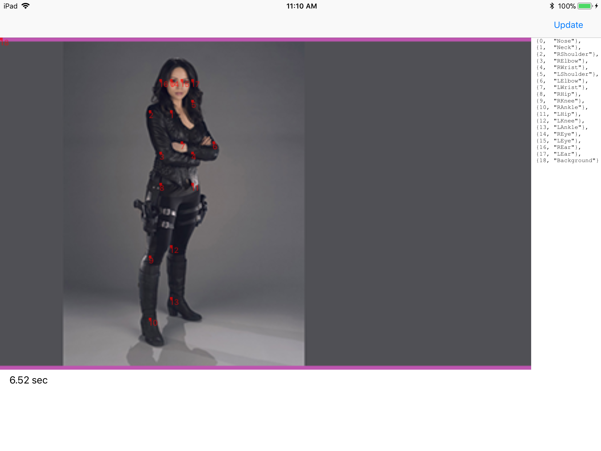
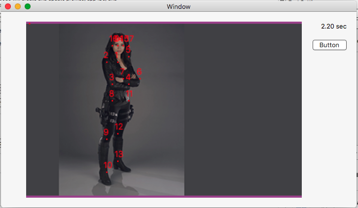

# Openpose caffe model test port to CoreML

## Converted models
https://1drv.ms/f/s!AsSRXEkyHtksh5NjgrM4hGWuTwg_Vg

## Example

## Requirements

- OSX 10.13 +
- IOS 11.0 +

## Technologies
- CoreML
- Swift 4

## Author

Andrey Pervushin
